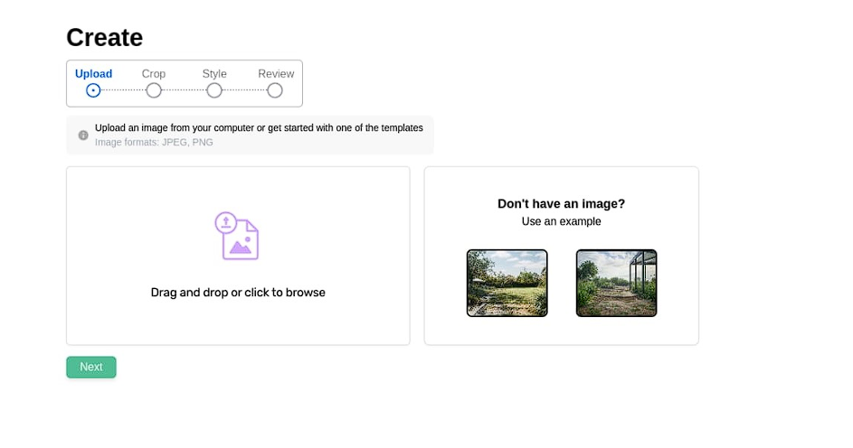

# Landscape Art Studio

## Overview
Landscape Art Studio is an innovative AI-driven application designed to transform how landscape images are edited and enhanced. By leveraging cutting-edge AI technologies, the project provides artists, designers, and hobbyists with intuitive tools for applying mask processing, generating high-quality enhancements, and customizing landscapes with ease. This application redefines digital creativity by seamlessly integrating user-defined inputs, advanced image processing, and a user-friendly interface.

---

## Features

### **Key Features:**
1. **Mask Processing:**
   - Allows users to select specific areas for editing or protect certain regions from changes.
   - Precise control over the editing process with enhanced customization.

2. **Image Enhancement and Upscaling:**
   - AI-driven techniques improve the quality and resolution of landscape images.
   - Maintains clarity and sharpness for professional-grade results.

3. **Prompt-Based Editing:**
   - Accepts natural language inputs to guide AI-driven enhancements.
   - Enables precise modifications to lighting, scenery, and other landscape features.

4. **Reusability of Outputs:**
   - Users can iterate on previous edits and manage multiple versions effectively.

5. **Interactive Interface:**
   - A responsive, user-friendly UI tailored for both novice and expert users.

---

## Directory Structure

```
moazzamumer-Landscape-Art-Studio/
├── backend/
│   ├── S3.py
│   ├── constant.py
│   ├── crud.py
│   ├── database.py
│   ├── dbinitial.py
│   ├── imagemodel.py
│   ├── init.py
│   ├── model.py
│   ├── prompt.txt
│   ├── promts.py
│   ├── test.py
│   ├── __pycache__/
│   └── models/
│       ├── helper.py
│       ├── tempCodeRunnerFile.py
│       └── __pycache__/
└── frontend/
    ├── README.md
    ├── jsconfig.json
    ├── package-lock.json
    ├── package.json
    ├── postcss.config.js
    ├── tailwind.config.js
    ├── yarn.lock
    ├── .gitignore
    ├── public/
    │   ├── index.html
    │   ├── manifest.json
    │   └── robots.txt
    └── src/
        ├── App.css
        ├── App.js
        ├── App.test.js
        ├── CONSTANTS.js
        ├── index.css
        ├── index.js
        ├── reportWebVitals.js
        ├── setupTests.js
        ├── assets/
        │   ├── Loader.json
        │   └── generic_loader.json
        ├── components/
        │   ├── Redirect.jsx
        │   ├── CropImage/
        │   │   ├── CropImage.jsx
        │   │   └── MobileCrop.jsx
        │   ├── FileUpload/
        │   │   └── FileUpload.jsx
        │   ├── Sidebar/
        │   │   └── Sidebar.jsx
        │   ├── Stepper/
        │   │   └── Stepper.jsx
        │   └── loader.component/
        │       ├── Loader.jsx
        │       └── LoaderComponent.jsx
        ├── context/
        │   └── CreateContext.jsx
        ├── hoc/
        │   └── layout.jsx
        ├── hooks/
        │   └── useIsMobile.jsx
        ├── pages/
        │   ├── Home.jsx
        │   ├── Create/
        │   │   ├── index.jsx
        │   │   ├── Create/
        │   │   │   └── Create.jsx
        │   │   ├── Crop/
        │   │   │   └── Crop.jsx
        │   │   ├── Review/
        │   │   │   └── Review.jsx
        │   │   └── Style/
        │   │       ├── Style.jsx
        │   │       └── style.css
        │   └── MyImages/
        │       └── MyImages.jsx
        ├── services/
        │   ├── index.js
        │   └── query.hook.js
        └── utils/
            └── utility.js
```

---

## Installation

### Backend:
1. Clone the repository:
   ```bash
   git clone https://github.com/moazzamumer/Landscape-Art-Studio.git
   ```
2. Navigate to the backend directory:
   ```bash
   cd moazzamumer-Landscape-Art-Studio/backend
   ```
3. Install the required dependencies:
   ```bash
   pip install -r requirements.txt
   ```
4. Set up environment variables for the database and S3 credentials.
5. Run the backend server:
   ```bash
   python main.py
   ```

### Frontend:
1. Navigate to the frontend directory:
   ```bash
   cd moazzamumer-Landscape-Art-Studio/frontend
   ```
2. Install dependencies:
   ```bash
   npm install
   ```
3. Start the development server:
   ```bash
   npm start
   ```

---

## Usage
1. Upload an image or use a sample.
2. Apply a mask to select specific areas for editing.
3. Provide a natural language prompt for desired changes.
4. Enhance and upscale images with AI-powered tools.
5. Save or download the output for future use.

---

## Technologies Used
- **Frontend:** React.js, TailwindCSS
- **Backend:** Python, FastAPI, PostgreSQL
- **AI Models:** Stable Diffusion, Hugging Face
- **Image Processing:** OpenCV, PIL
- **Cloud Storage:** AWS S3

---

## Frontend Images



---

## Contribution
Contributions are welcome! Please fork the repository, create a new branch, and submit a pull request.

---

## License
This project is licensed under the MIT License - see the LICENSE file for details.
